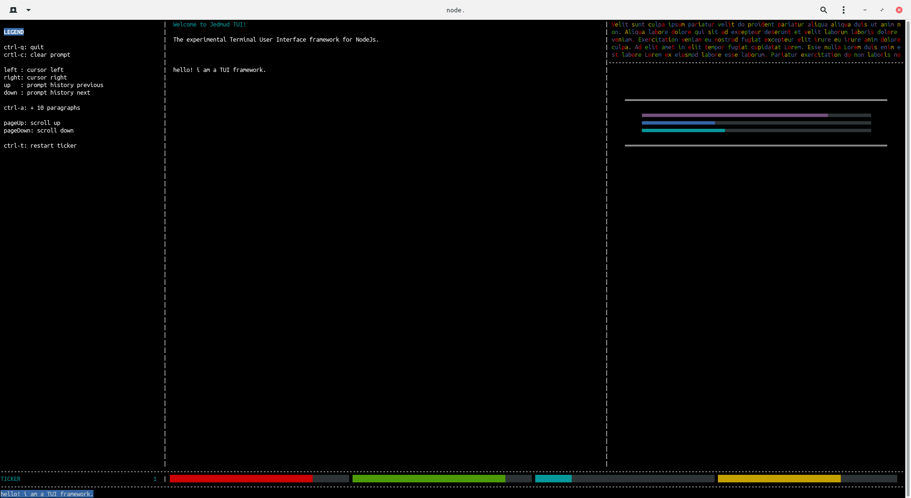

# JedMud TUI

JedMud TUI is a experimental terminal user interface for the NodeJs framework. It uses ANSI escape codes to write elements on the screen.

Jedmud was developed on NodeJs v16. It may or may not work on other versions.

Working example covering most features: https://github.com/jedmud/tui-example

## Slots

`npm i @jedmud/tui-slots`

Slots define element positions relative to screen parameters. One slot may be used by multiple elements. Also multiple elements instances may get parameters from one slots instance.

Example: https://github.com/jedmud/tui-example/src/examples/slots.js

## Elements

`npm i @jedmud/tui-elements`

Elements give slots behavior. Each element configuration may have different available options.

Example: https://github.com/jedmud/tui-example/src/examples/box.js



### Official element types

#### Box

`npm i @jedmud/tui-box-element`

https://github.com/jedmud/tui-example/src/examples/box.js

#### Prompt

`npm i @jedmud/tui-prompt-element`

https://github.com/jedmud/tui-example/src/examples/prompt.js

#### Scroller

`npm i @jedmud/tui-scroller-element`

https://github.com/jedmud/tui-example

#### Metrics

`npm i @jedmud/tui-metrics-element`

https://github.com/jedmud/tui-example

#### Timer

`npm i @jedmud/tui-timer-element`

https://github.com/jedmud/tui-example

## How to install example module

```
git clone https://github.com/jedmud/tui-example
cd tui-example
npm i
node .
```

There are also more specific and simpler working code examples in the `examples` folder.
